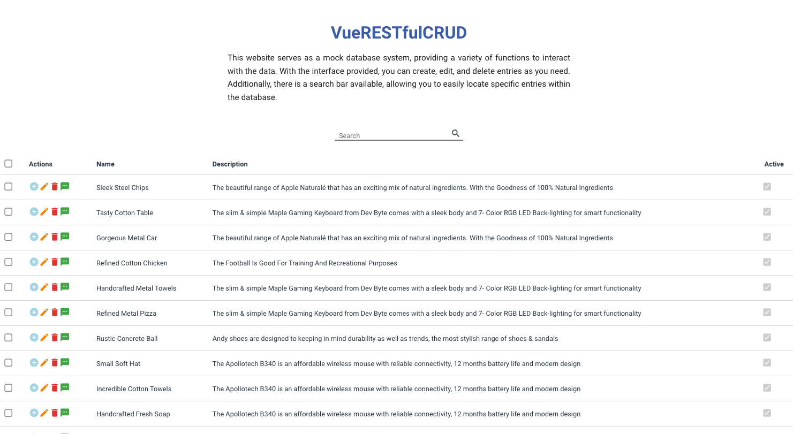

# 📝 VueRESTfulCRUDify 📝

Welcome to the VueRESTfulCRUDify GitHub repository! This fantastic project is designed to simplify your data management tasks with Vue.js. With our robust RESTful API, you can effortlessly perform CRUD operations – Create, Read, Update, Delete – on your database entries. Our user-friendly interface makes it a breeze to add, edit, and delete entries, streamlining your workflow. Plus, we've added a powerful search bar feature, ensuring you can quickly locate specific entries within the database. Embrace the convenience and efficiency of VueRESTfulCRUDify and take your data management capabilities to the next level in your Vue.js applications!

## Live Website 🌐

### [VueRESTfulCRUDify](https://vue-res-tful-cru-dify.vercel.app/)

## Developer 🤝

### 🧑‍💻 [David Benner](https://github.com/davebenner14)

## Technologies Used 💻

- [Vue.js](https://vuejs.org/guide/introduction.html)
- [JavaScript](https://developer.mozilla.org/en-US/docs/Web/JavaScript)
- [HTML](https://developer.mozilla.org/en-US/docs/Web/HTML)
- [CSS](https://developer.mozilla.org/en-US/docs/Web/CSS)

## Screenshots 📸



## Getting Started Yourself 🚀

To get started with this project, follow these steps:

First, install Vue CLI, if you haven't already, using the following command:

```
npm install -g @vue/cli
```

Create a new Vue.js project using:

```
vue create <project name>
```

Install the required dependencies:

```
npm install
```

Test your application:

```
npm run serve
```

## CRUD Operations 📚

The Data Management Component is a Vue.js-based solution designed to facilitate basic data management tasks for a collection of items. The component allows users to perform CRUD operations, namely Create, Read, Update, and Delete, on the data collection. It maintains the data in an array named data and employs a nextId variable to ensure each newly added item is assigned a unique identifier. The component offers three essential methods: addData, editData, and deleteData. The addData method permits users to add new items to the array, generating a unique ID for each entry. Meanwhile, the editData method allows for updating existing items based on their ID, and the deleteData method enables the removal of items from the array. For detailed implementation, users can integrate the component into their Vue.js applications, adapting the HTML structure and functionality as required to effectively manage their data collection.

```<template>
  <div>
    <!-- Your template code here -->
  </div>
</template>

<script>
export default {
  data() {
    return {
      data: [], // Your data items
      nextId: 1, // For generating unique ids for new data items
    };
  },
  methods: {
    addData(dataItem) {
      const fullDataItem = {
        id: this.nextId,
        ...dataItem,
        active: true,
      };
      this.data.unshift(fullDataItem);
      this.nextId++;
    },
    editData(dataItem) {
      const index = this.data.findIndex((item) => item.id === dataItem.id);
      if (index !== -1) {
        this.data.splice(index, 1, dataItem);
      }
    },
    deleteData(dataItem) {
      const index = this.data.findIndex((item) => item.id === dataItem.id);
      if (index !== -1) {
        this.data.splice(index, 1);
      }
    },
  },
};
</script>


```

## Going Forward 🚀

Thank you for diving into VueRESTfulCRUDify and exploring its powerful data management capabilities! I hope you find this tool incredibly helpful for simplifying CRUD operations in your Vue.js applications. Your experience with VueRESTfulCRUDify matters to us, and we're eager to hear your thoughts, feedback, and any ideas you'd like to share. Together, let's take data management to new heights and make your Vue.js projects even more efficient and enjoyable! Happy coding, and may VueRESTfulCRUDify supercharge your development journey! 🎉😊
